# Lab 2: Display Trips and Receipts

## Create and save your app

1. Open [make.powerapps.com](https://make.powerapps.com) and select an environment where you have permissions to create Canvas Apps.
2. Select **Start with a blank canvas**
3. Select **Responsive**
4. Wait a little - maybe its a good idea to take a sip 🥤

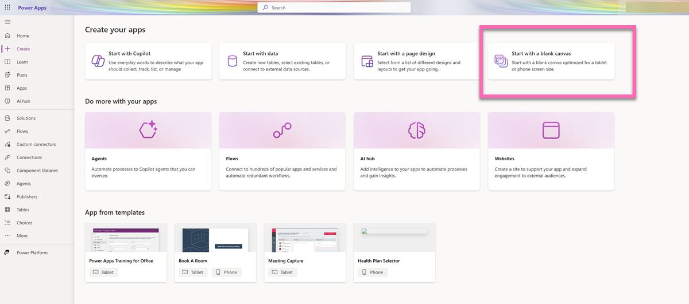

5. You will be welcomed with this screen - Select **Skip**

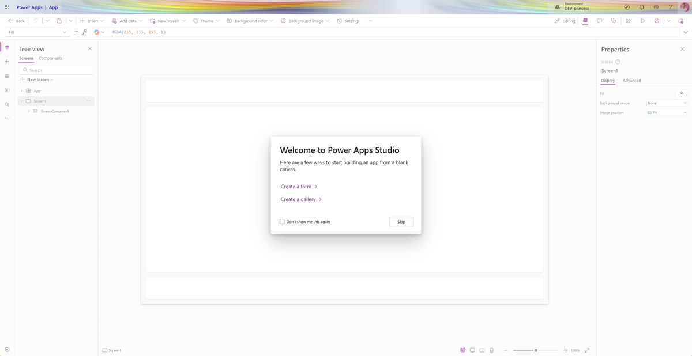
6. Do the most important step of this tutorial and save your app. Once you did that, auto-save will hit in and your progress will be saved automatically. Name your app `Expenses Tracker`.

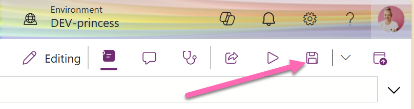

> If you do not hit that button ONCE and close your browser/shut down your laptop everything will be lost. Ask us, how we know 🫣

7. Enable modern controls by **Settings** > **Updates**. Now type `modern` into the searchbar and turn the toggle of **Modern controls and themes** **ON**. 
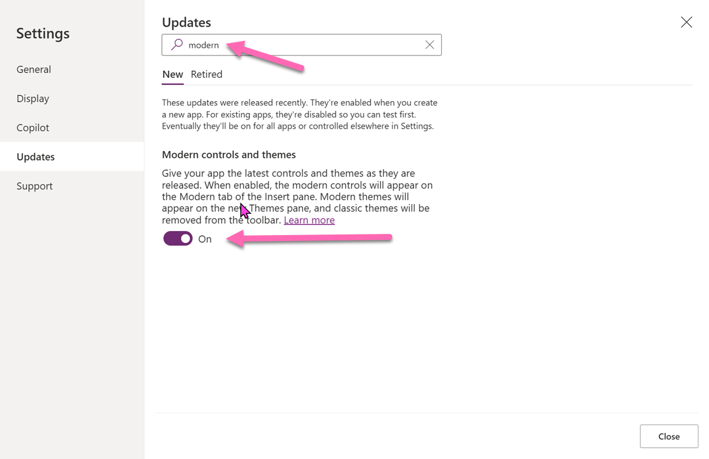

## Get your data into the app

1. Navigate to **Data** > **Add data** 

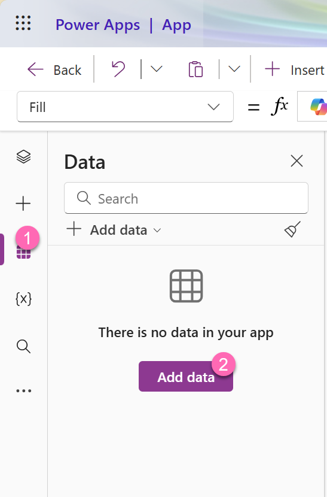

2. Enter `SharePoint` into the searchbar

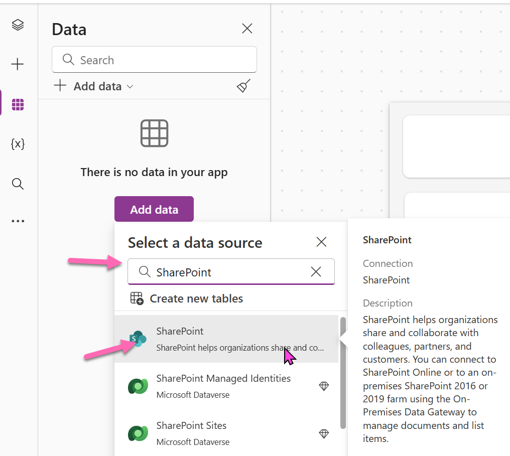
3. Select **SharePoint**

4. If you do not already have a connection, add a connection by selecting **Add a connection** 
5. Select **Connect**

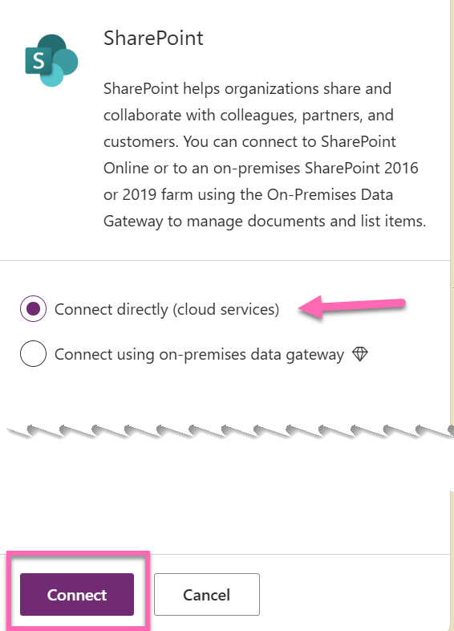

6. You can now *either* enter the List URL of your **Trips** and **Receipts** list *or* enter the name of the SharePoint site where your list lives under **Recent Sites** to help find the right list.

7. In the next step, select your **Trips** and *Receipts** lists and select **Connect**

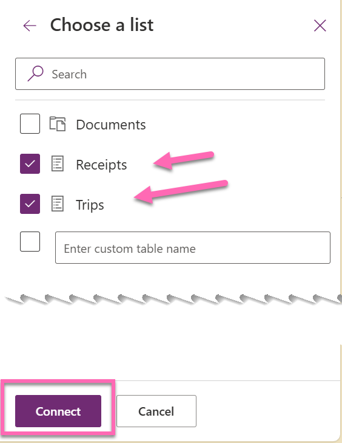

8. As a result, your SharePoint lists will now appear in the data tab:

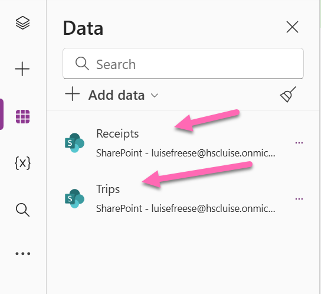

## Create a Screen

1. Select the tree view

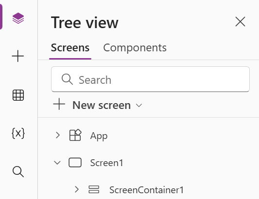

2.  Select **New Screen** > **Sidebar**

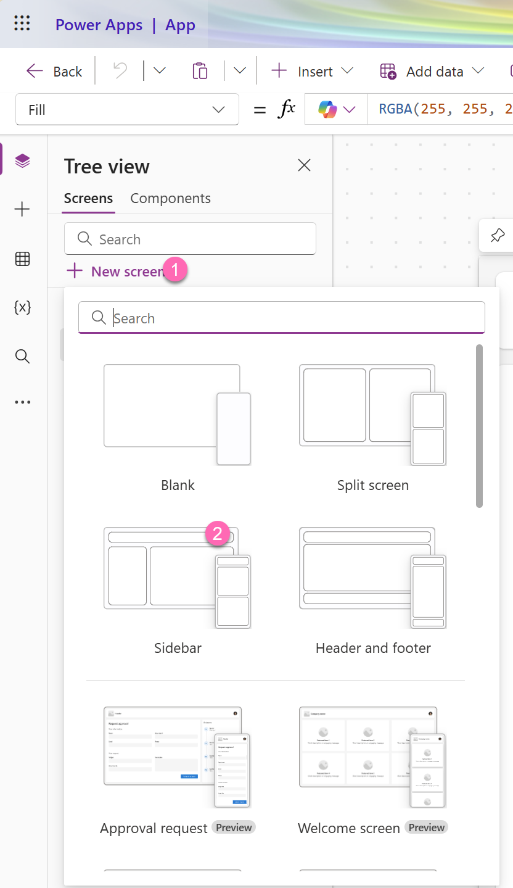 

3. Rename **Screen2** to **Trips Screen** by selecting the `...` menu > **Rename**
4. Familiarize youreself with the structure of the screen: 
   - HeaderContainer
   - BottomContainer
     - SidebarContainer
     - MainContainer

We rename them to get some consistency - makes it easier later! the **F2** key is your friend!

Also you can now delete the auto-generated **Screen1**.

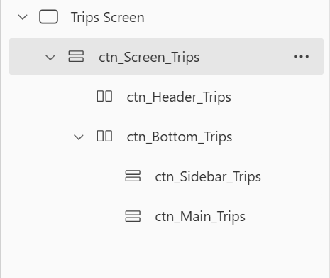

### Header

5. Select the **ctn_header_Trips** 
6. Select **Insert** and type into the searchbar `header` and select the **Header** control

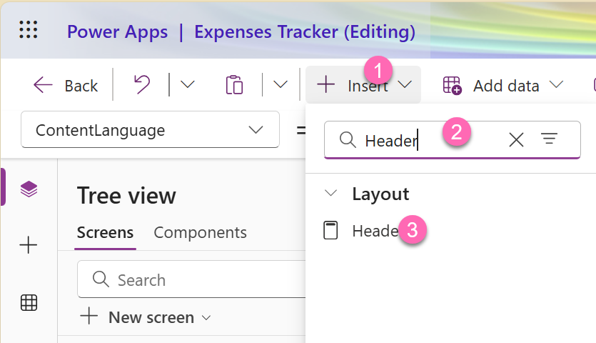

7. Turn off **Show Logo** in the properties bar

### Sidebar

We will now take care of the sidebar. 

1. Select **ctn_Sidebar_Trips**
2. Select **Insert**, search for `gallery` and select **Vertical gallery**

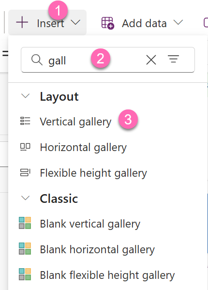

3. Connect the gallery to your **Trips** data source
4. Select **Layout** > **Title, subtitle and body**
5. Rename it to `gal_Trips`

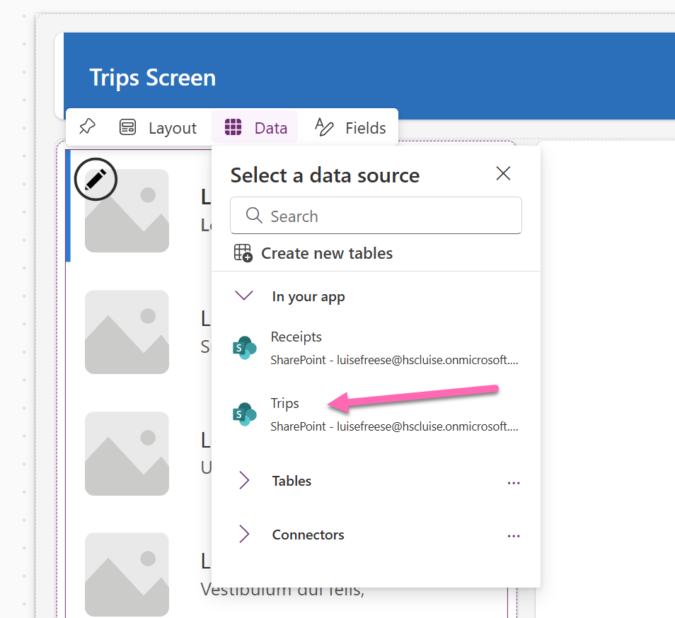

6. Set the **Width** of the gallery to `Parent.Width`
7. Delete the **NextArrow**
8. Select the Title in the gallery and set it to `ThisItem.Title`
9. Select the Subtitle in the gallery and set it to `ThisItem.Start & " - " & ThisItem.End`. This will concatenate the Start and End Date of the Trip and make it have a `-` in between.
10. Select the Body in the gallery and set it to `ThisItem.Status.Value` - this will display the value of the Status column.  

You can now press the ALT key on your keyboard down and then select the different trips in the gallery and see the selected one being highlighted in bold text and with the rectangle being displayed

## Main Container

Now lets make sure we also get the trips into the Screen:

1. Select `ctn_Main_Trips`
2. Add a gallery, rename it to `gal_Receipts`
3. Set the **Data source** to **Receipts**
4. Set layout to **Title and subtitle**
5. Set the **Items** of the **gal_Receipts** to `Filter(Receipts, Trip.Id = gal_Trips.Selected.ID)` - this will make sure that we only get the receipts that are applicable to the selected item in the **gal_Trips**

> Ignore the Delegation warning for now - we will talk about that in a bit

6. Set the **Width** of the **gal_Receipt** to `Parent.Width`
7. Set the TItle of **galReceipts** to `ThisItem.Title` and the Subtitle to `ThisItem.Amount & " " & ThisItem.Currency`
8. Delete the NextArrow

Your screen should now look like this:

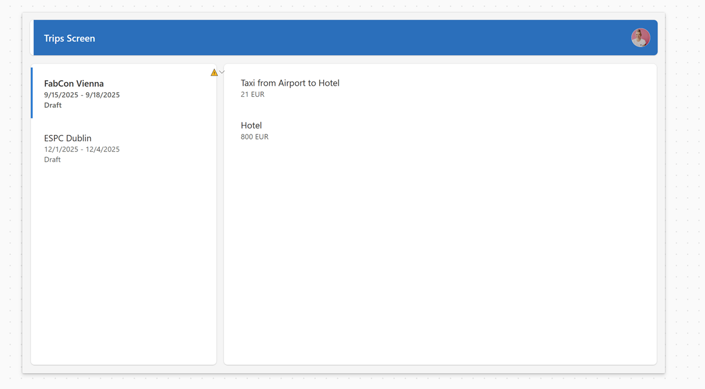

🎸 You rock! You made it through lab 2! Continue now with [Lab 3](lab-3.md)

