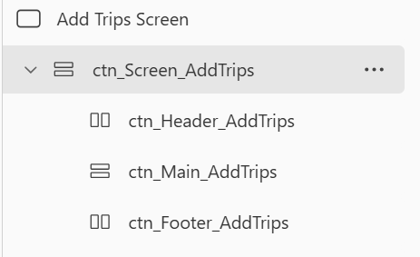
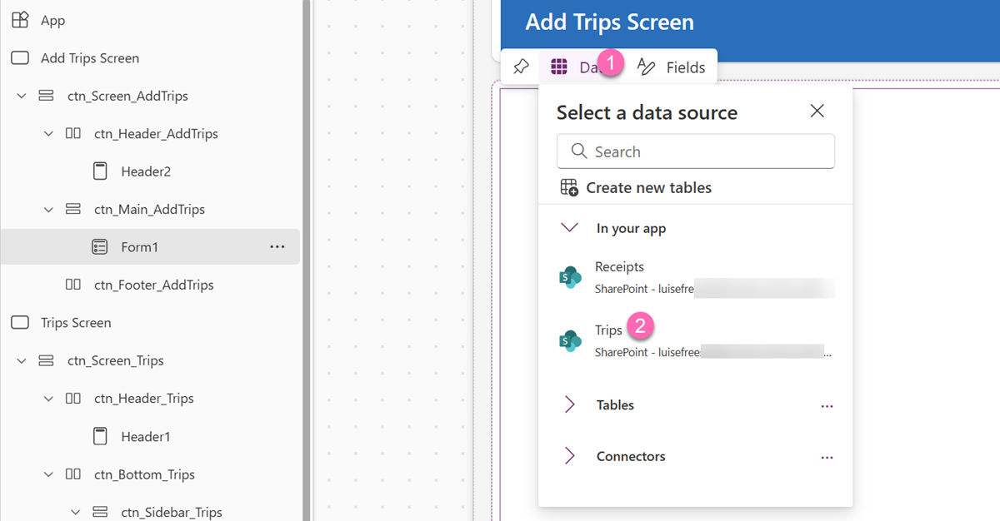
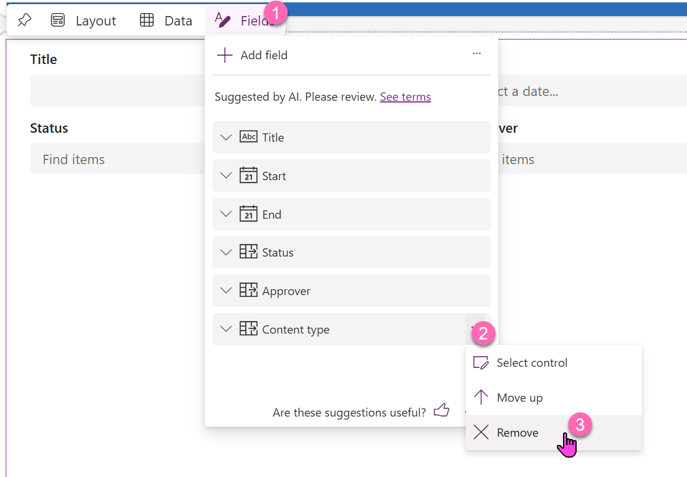
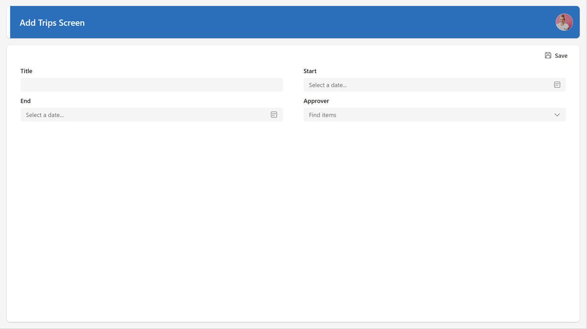

# Create new Trips and add new receipts

## Create new Trips

We now want to allow users to add new trips.

### Insert Add new Trip Button

1. Select **ctn_Sidebar_Trips**
2. Insert a new button, rename it to `btn_AddTrip`
   - **Text**: `Add new Trip`
   - **Icon**: `+`
   - **Layout**: `Icon Before
   - **Type**: `Subtle`
   - **Width**: `140`
   - **Align in container**: `End`
3. Move that button to the top: `...` > **Reorder** > **Move to the top**

### Create a new Screen

We still have **Screen1** - this has been auto-generated when we created the app. We can now repurpose this screen for the form to add new trips

1. Rename the **Screen1** to `Add Trips Screen`
2. Rename the existing containers to this: 

(If you have ideas for the Footer container: Go for it, you also also delete it)

3. Insert a header control into the header container. Style it the way you did with the one on the Trips Screen.
4. In **ctn_Main_AddTrips**, add a Form control, rename it to `frm_addTrip` and 
5. Select **Trips** as the datasource
6. Set its **Default mode** to `New`

7. Remove the **Content type** and the **Status** field

8. Change to **Columns**: `2` Layout
9. Rightclick the **Approver_DataCard**, select **Unlock**
10. Select the **DataCardValue** and select **Fields: Edit** in the Property pane > **Add field** > **DisplayName**
11. Select the **ctn_Main_AddTrips** container and add a Button:
   - **Text**: `Save`
   - **Icon**: `Save`
   - **Type** `Subtle`
   - **Align in container**: `End`
12. Now move the button to the top
13. In the **OnSelect** of the button, put `SubmitForm(frm_addTrip); ResetForm(frm_addTrip); Navigate('Trips Screen')` to submit the form, reset its entries and Navigate back to the Trips Screen.
14. On the Trips Screen, select the **Add New Trip** button and set its **OnSelect** to `Navigate('Add Trips Screen')`

Your Add Trips Screen should look like this:

> [!NOTE]
> We have talked about the missing functionality in the prople picker to access your whole company. Matthew Devaney has an [excellent article](https://www.matthewdevaney.com/power-apps-people-picker-delegation-workaround/).

☘️ Whoohoo, you made it through lab 3 and with that completed your main quests! If you still have time, you can now work on the Sidequests!