# Send an approval to the approver

In this lab we'll create our first flow that will be triggered when a new trip reaches the status `Submitted`. The trip is then sent for approval to our selected approver and can be accepted or rejected. That change is then reflected in the SharePoint list.

## Create a new Power Automate flow and select the trigger

We head over to [make.powerautomate.com](https://make.powerautomate.com/) and select the correct environment.

> [!TIP]
> A best practice would be to create all your Apps, Flows (and other artifacts) from within solutions.
> Read up about solutions [here](https://learn.microsoft.com/en-us/power-apps/maker/data-platform/solutions-overview).

Click on **Create** and select **Automated Cloud Flow**

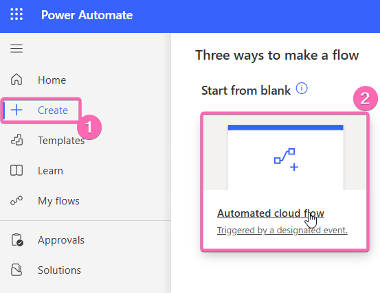

We will name the flow `Trip approval` and set the trigger to `When an item is created or modified (SharePoint)`.

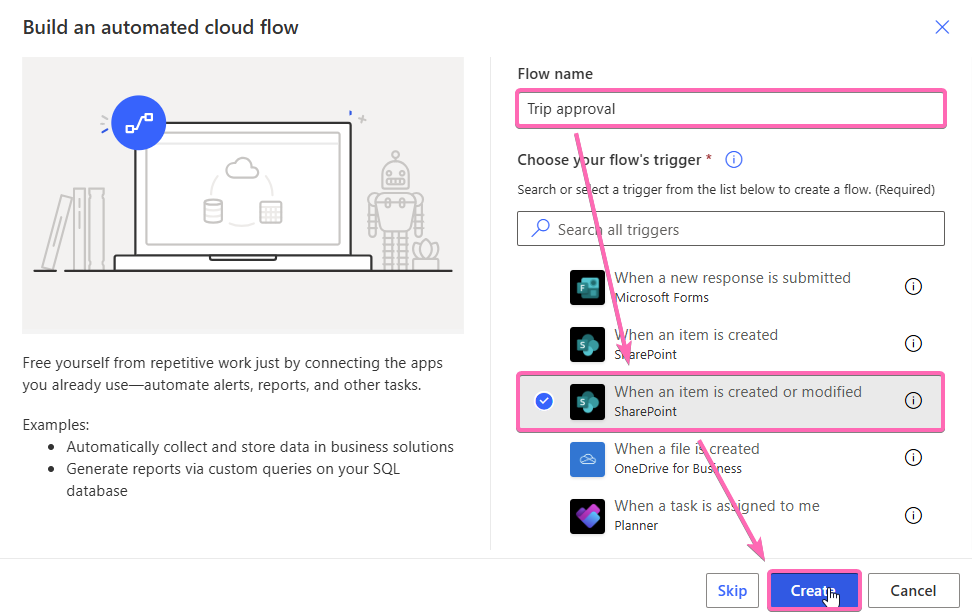

Hit create and after a short while the resulting flow should look like this.

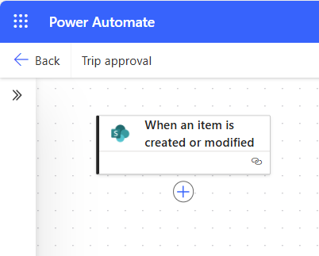

Select your SharePoint site and the `Trips` list in the trigger action.


> [!NOTE]
> If you are doing this for the first time on this environment, a connection is created that will define that the SharePoint actions used in this flow will run with your credentials. This will happen for every connector we use.

## Add a trigger condition

> [!WARNING]
> Trigger conditions are an advanced technique, but are the absolute correct approach in this scenario. Don't feel intimidated, it gets easier from here on.
> If you want to dive deeper into the concept, here is the [documentation](https://learn.microsoft.com/en-us/power-automate/customize-triggers?tabs=new-designer)

The trigger would currently trigger in unwanted scenarios. It would start the flow the first time the item is created and any subsequent time that the item is modified. With the trigger condition we'll make sure, that the flow only runs when the item is in the **Status** `Submitted`.

We can check that programmatically with a trigger condition. Click on the trigger and select **Settings**. Add the following code as a new trigger condition

```
@equals(triggerOutputs()?['body/Status/Value'], 'Submitted')
```

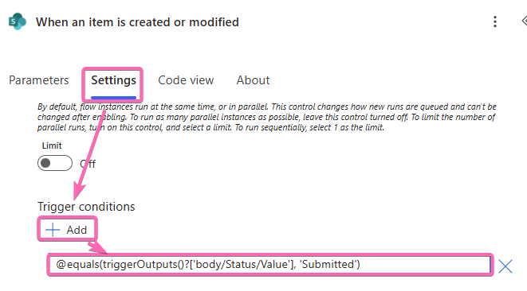

Make sure to match the exact name of the column of your SharePoint list (here: `Status`) and choice value (here: `Submitted`)!

## Add the approval workflow
Click on the **+** to add a new action. Type `Approval` into the search bar and select the action `Start and wait for an approval`.

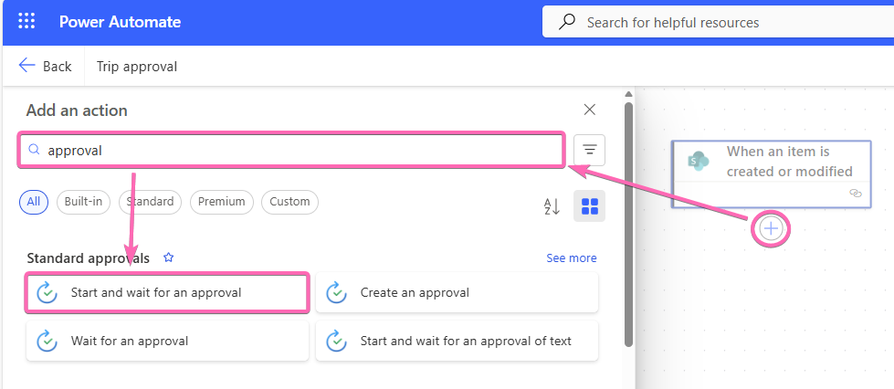

As **Approval type** we will select `Approve/Reject - First to respond`.
In the **Title** we will write `Approval request for Trip Expenses - ` and while having the cursor still in the **Title** field we click on the lightning bolt and select `Title` from the SharePoint list.

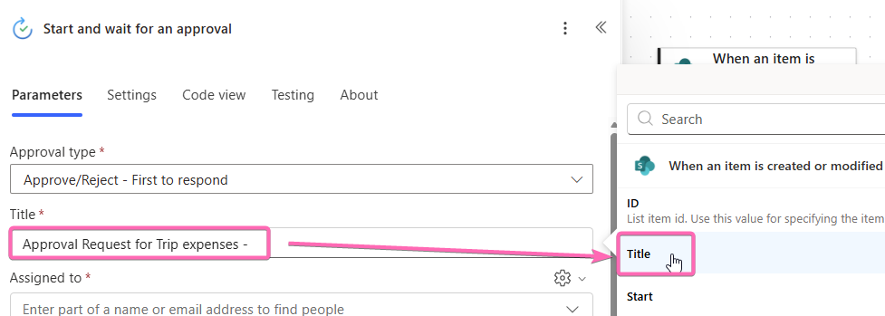

> [!TIP]
> It's a fundamental principle in Power Automate to use Output parameters of previous actions in following actions. This will allow us to dynamically populate any input for every action.

For **Assigned to** we have to click on the cog and set the field to `Use dynamic content`. Then we will use the same principle as before and select the `Approver Email` (either use the search bar to search for *Email* or click on *See more* on top to see all the ~50 fields from the trigger)


I did create a view on the SharePoint list, that will group the expenses by `Trip: ID`. When setting a filter to the `Trip: ID`, you can see that it will be reflected in the URL. We can create such a filter dynamically by combining the first part of the URL and dynamically adding the `ID` as the **Item Link** of the approval. We also add the `Title` of the Trip as **Item Description**. This will allow the approver to click on the link and review the items in SharePoint.

My Link looks like this, feel free to create something similar.

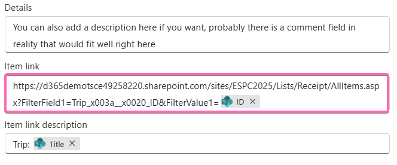

## Test

Our flow is not ready, but it's a good time to save and test our flow for the first time. Hit **Save** and after everything was processed hit **Back**. In a new browser tab add a new entry to your SharePoint **Trips** list and set the **Status** to `Draft` and save the item (either through the SharePoint interface or your newly created Power App). Make sure to set yourself as the approver and then set the **Status** to `Submitted`. This should result in only one flow run that you can check on your flows overview page and you should receive an approval workflow in teams. Answer that workflow by either approving or rejecting.

> [!TIP]
> If you see two flow runs you forgot to set the trigger condition.
> If you see no flow run, wait a few more seconds and refresh. If you still see nothing double check that your trigger condition matches the field name and value of your SharePoint list.

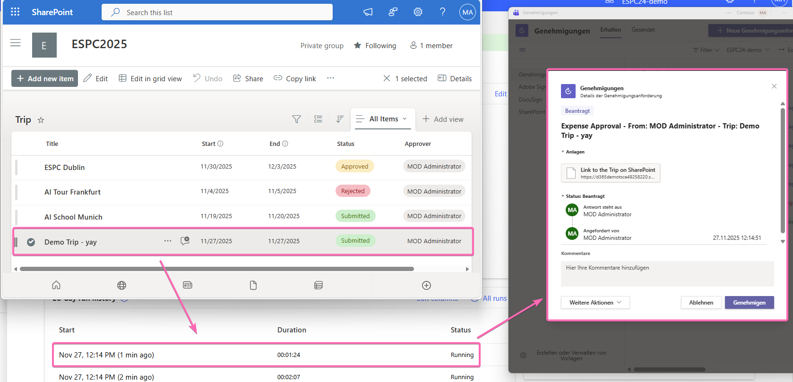

> [!NOTE]
> You can run subsequent tests for automated flows also from the **Test** button in the editor and simulate the last 5 triggers. This can be convenient, if you don't want to actually recreate the trigger conditions every time.

## Add a condition to check on the outcome of the approval

Now we need to add a condition to either set the **Status** of the Trip to `Approved` or `Rejected` and inform the user. Let's check the outputs of the approval action and see which property we can use for the condition. On the test flow run click on the **Approval** action and the on **Show raw outputs**.

In the image we can see, that there is a property called **Outcome** and depending on how you decided it says `Approve` or `Reject`.

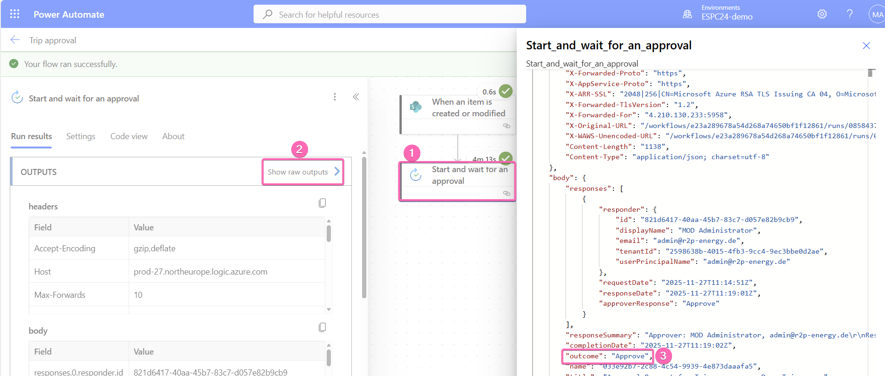

We go back to editing our flow and add the next action. Search for `Condition` and add it to your flow.

Dynamically add `Outcome` of the Approval action and select **equal to** `Approve`

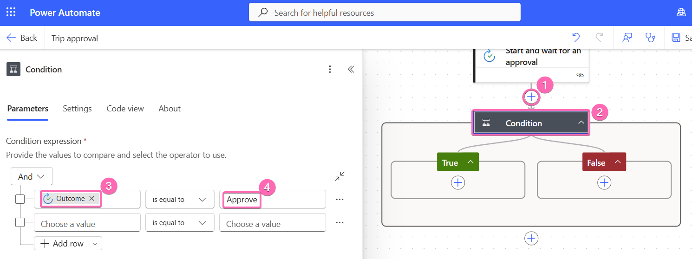

Every time the approval is approved, the automation will go to the **True** path. Every time it is rejected, it will go to the **False** path.

## Inform the user and set the new status

Finally we need to update the item to the respective status and inform the user in form of an Email about the decision.

To update the item we will add an **Update Item** action from the SharePoint connector and select our SharePoint and our Trips list.

Set the **Id** dynamically to the `ID` from our trigger and set the **Status** to `Approved`.

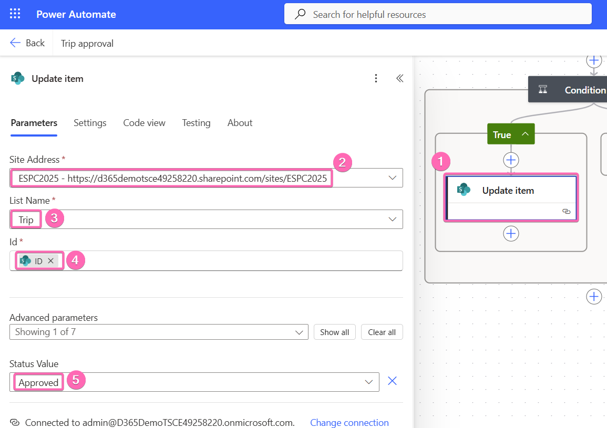

Let's finally write an Email to the lucky user that gets reimbursed. Add the **Send an Email (V2)** action from the **Office 365 Outlook** connector. Use the cog to set the input box to `Use dynamic content` and set it to `Created by Email` from our trigger. Find some nice words in the **Subject** and **Body**. Repeat the process for the `Reject` branch and test your flow. It would make sense to add the `Responses Comment` to the rejected branch, to inform the user why the request was rejected.

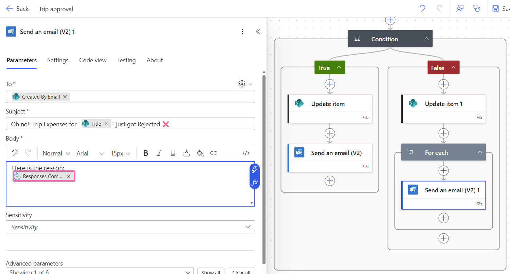


> [!NOTE]
> The approval action could theoretically also have multiple approvers, therefore it could have multiple comments (even though in our case we are 100% sure it's only one approver). That's the reason why the approval comments are inside of an array in the output and a **For each** loop is created automatically. Because we only have 1 comment, we can ignore that for now and look deeper into it in the next lab.

> [!WARNING]
> There is an old **Outlook.com** connector that is deprecated. Avoid selecting that one by accident.
