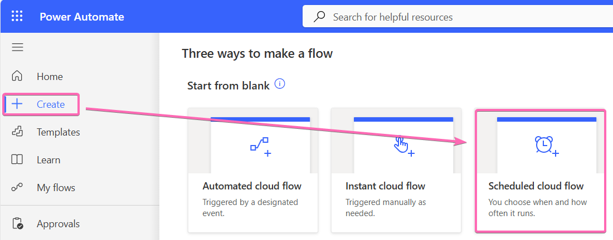
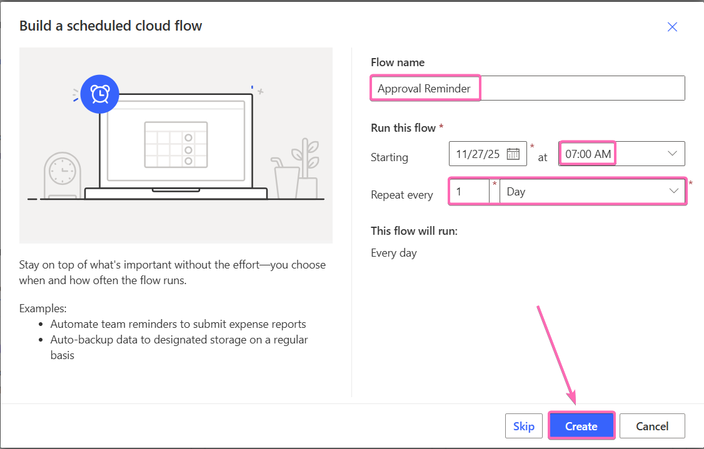
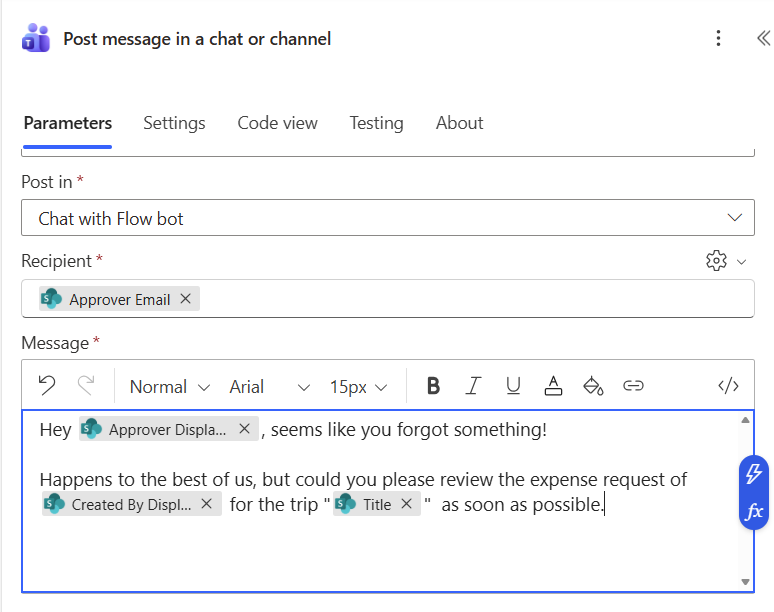
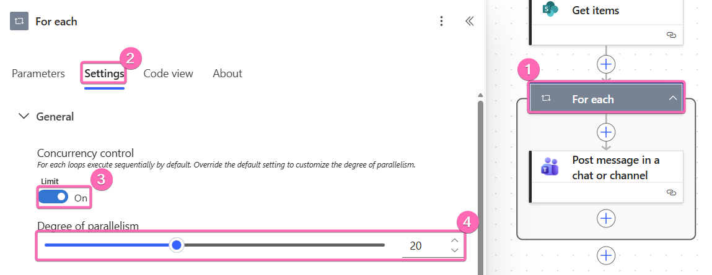
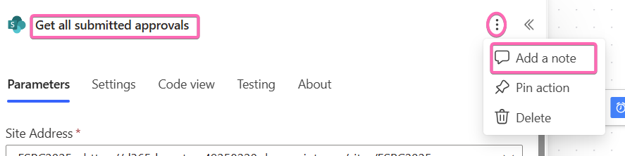

# Remind the approver for open approvals

Sometimes people need to be reminded of their open work items... We'll build a flow that checks daily, if there are any items with the status `Submitted` and inform the designated approver via Teams about the open approval.

## Create a new flow

We create a new `Scheduled cloud flow` in Power Automate.

We call it `Approval Reminder` and set it to an early morning time and let it repeat every `1 Day` and hit **Create**. This flow will then run every morning at 7 AM and remind the approvers.

## Get all open approvals

We will add a `Get items` action from the SharePoint connector and fill in our SharePoint and `Trips` list.

This would return us all approvals, but we are specifically looking for the approvals with the **Status** of `Submitted`. There is a **Filter Query** property that allows us to write an expression that will filter the list on the server side and only return the respective items.

Use this filter query, but make sure to use the exact column name and choice value (as in the trigger condition in lab 4).

## Write a Teams message for every item

Add the `Post message in a chat or channel` action from the Teams connector and populate the fields. For the **Recipient** we have to select the cog and select `Use dynamic content` before we can input `Approver Email` as value.

Make up a nice message to remind the approver and add that as well.

## For each loop

You should have noticed, that a **For each** loop was added automatically. This means, that for each item a separate Teams message is sent out. In the test screen you can also see the details for every single execution. Because this can take a little longer, when you have multiple items, there is a setting, that allows you to send those in parallel if you want to save time.

Click on **Settings**, switch the **Concurrency control** `On` and select how many iterations you want to execute in parallel (up to 50).

## Test

Make sure you have some items in SharePoint that have the **Status** `Submitted` and test your flow manually from the editor.

☘️ Whoohoo, you made it through lab 5 and with that completed your main quests! If you still have time, you can now work on the [Sidequest](sidequests.md#power-automate) or read up on the Power Automate best practices!

## Power Automate Tips, Tricks and best practices

Power Automate is a powerful tool and there are endless possibilities. Today we created two easy workflows with a very limited set of actions and functionalities. If your flows grow more complex you should make yourself familiar with the most important best practices for the tool.

### Rename and comment actions

Your actions will be called `Get items`, `Get items 1`, `Get items 2` and so on. To keep track what's happening in your flow, make sure to properly rename the actions and add important comments as notes.

Click on the title of a trigger or action to rename it. Click on the 3 dots to add a note

### Error handling

Error handling is crucial in Power Automate and you should know how the *try, catch, finally* pattern in Power Automate works. Make sure to implement it (at least) in every business critical flow.

The scopes you'll use can also help to structure your flow a bit better.

The editor looks a bit different now, but our friend Matthew Devaney has a top notch [article](https://www.matthewdevaney.com/power-automate-coding-standards-for-cloud-flows/power-automate-standards-error-handling/) as part of his [Power Automate Coding Standards](https://www.matthewdevaney.com/power-automate-coding-standards-for-cloud-flows/).

### Agent flows in Copilot Studio

To succeed with Copilot Studio, you have to understand Power Automate, because you will use a lot of flows in your Copilot Studio agents. Also other parts like the connector system will look pretty much the same in Copilot Studio.

### Deterministic automations will never die

No matter what anyone is trying to tell you: deterministic automation with Power Automate or similar tools will never die. Autonomous Agents have their place and expand our automation capabilities, but if an automation has predetermined steps, don't let an AI figure out the steps again...